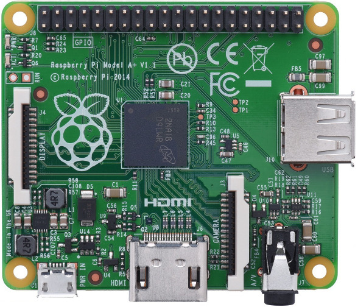
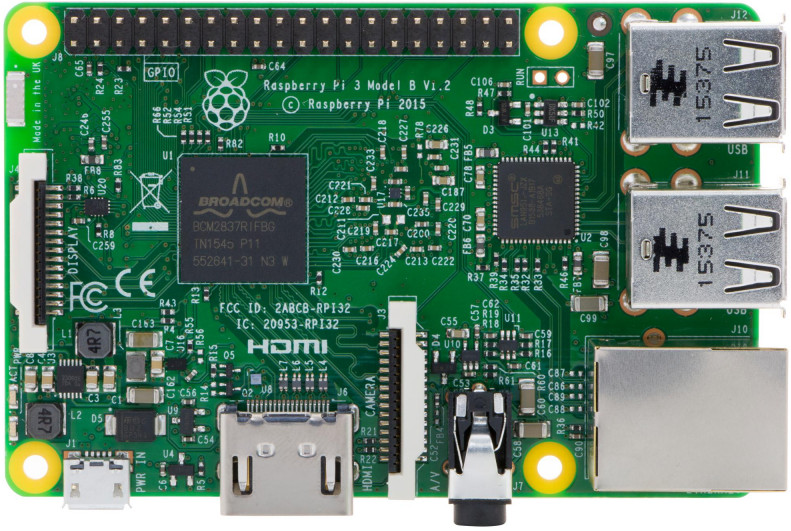
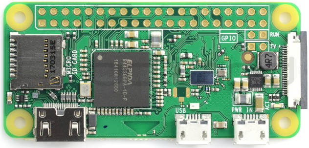

<p align="center">  </p>
<p align="center">  </p>
<p align="center">  </p>


# Raspberry PI code examples

* **pcd8544_lcd**: Code examples to control Raspberry PI PCD8544 display
* **pi_camera**: Code example to control Rspberry PI Camera
* **sense_hat**: The RaspberryPi Sense HAT code examples 

## Cloning the repository

To obtain this repository, make sure **git** is installed locally:

```bash
$ sudo apt-get install git
``` 
Then clone this repository to a local folder such as **rpi**

```bash
$ git clone https://github.com/mkhuthir/RaspberryPi.git rpi
```

See subfolders for instructions of each example
