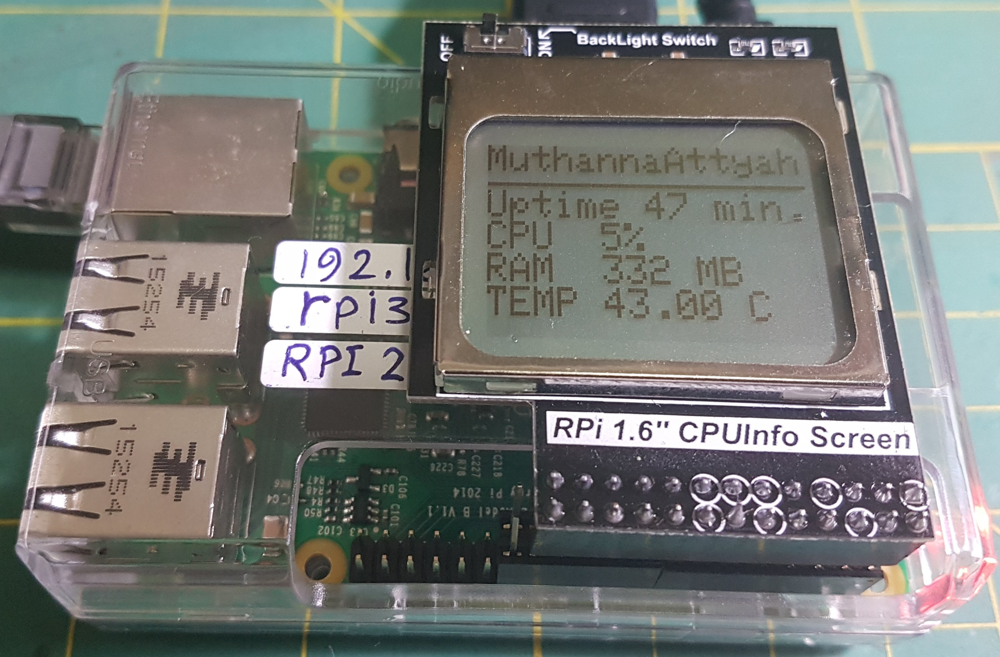

# Raspberry PI code examples

# PCD8544_LCD


<p align="center">  </p>

Code to control PCD8544 LCD dispay for Raspberry PI. To run this code do the following:

* WiringPI library is required to compile/run PCD8544 code. You can install it using the following command:

```bash
$ sudo apt-get install wiringpi
```

* clone this repo to a local folder such as `rpi`

```bash
$ git clone https://github.com/mkhuthir/RaspberryPi.git rpi
```

* change to PCD8544_LCD folder

```bash
$ cd rpi/PCD8544_LCD/
```

* compile code:

```bash
$ ./compile.sh
$ ./main
```

